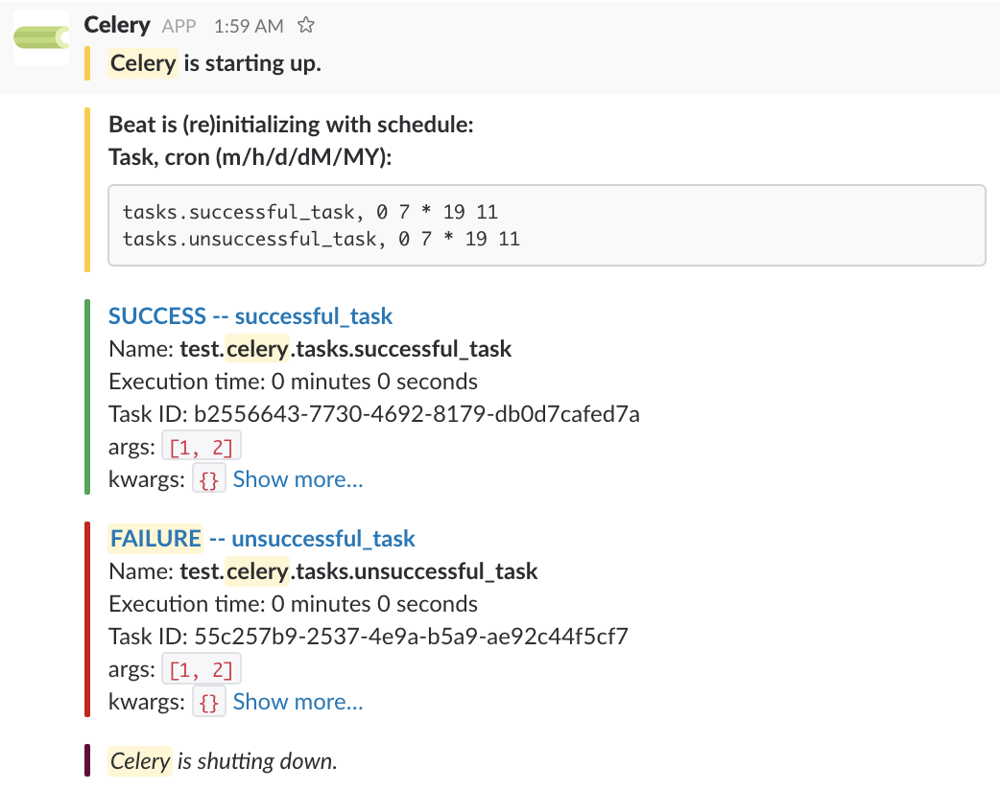

.. celery-slack documentation master file, created by
   sphinx-quickstart on Thu Nov 23 08:00:32 2017.
   You can adapt this file completely to your liking, but it should at least
   contain the root `toctree` directive.

celery-slack
============

|travis| |rtd| |codecov| |pypi| |pyversions|

.. |travis| image:: https://img.shields.io/travis/crflynn/celery-slack.svg
    :target: https://travis-ci.org/crflynn/celery-slack

.. |rtd| image:: https://img.shields.io/readthedocs/celery-slack.svg
    :target: http://celery-slack.readthedocs.io/en/latest/

.. |codecov| image:: https://codecov.io/gh/crflynn/celery-slack/branch/master/graphs/badge.svg
    :target: https://codecov.io/gh/crflynn/celery-slack

.. |pypi| image:: https://img.shields.io/pypi/v/celery-slack.svg
    :target: https://pypi.python.org/pypi/celery-slack

.. |pyversions| image:: https://img.shields.io/pypi/pyversions/celery-slack.svg
    :target: https://pypi.python.org/pypi/celery-slack

Celery-slack is a `Celery <http://docs.celeryproject.org/en/latest/index.html>`_
extension that posts messages to a Slack channel
regarding a Celery application, its beat schedule, and its worker task
execution. Optionally, those messages can link to
`Flower <http://flower.readthedocs.io/en/latest/>`_ task pages.

Prerequisites
-------------

To use this package you will need an incoming webhook associated with a Slack
channel. You can use Slack's
own `incoming webhook integration <https://my.slack.com/services/new/incoming-webhook/>`_
or create a Slack application from `this page <https://api.slack.com/apps>`_
with an incoming webhook registered to one of your Slack channels. See
`Slack incoming webhooks <https://api.slack.com/incoming-webhooks>`_ for more
information.

Installation
------------

Celery-slack is a python package available on
`pypi <https://pypi.python.org/pypi>`_ and can be installed using ``pip``:

.. code-block:: python

   pip install celery-slack

Compatibility
-------------

Celery-slack is tested against Celery versions 3.1, 4.0, and 4.1, across
corresponding compatible versions of Python including 2.7, 3.3, 3.4, 3.5, 3.6.
It may or may not work on other versions of Celery and/or Python.

Documentation
-------------

.. toctree::
   :maxdepth: 2

   slack
   usage
   notes
