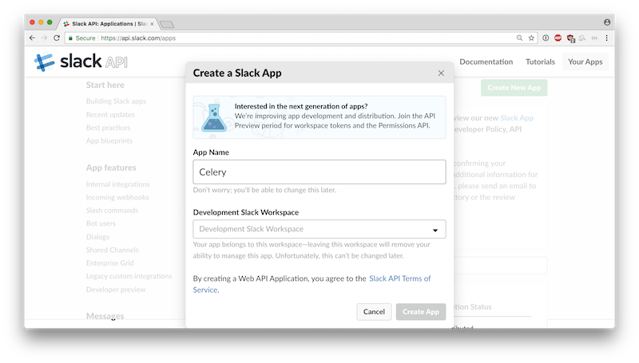
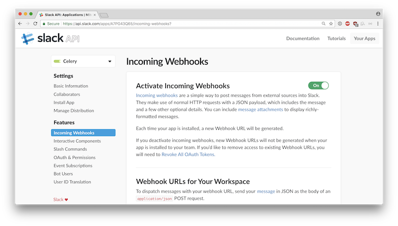

Configuring Slack
=================

Create a Slack App and Webhook
------------------------------

In order to use celery-slack, you will need to create a Slack App for your
organization's Slack workspace. You can create an App from
`the Apps page <https://api.slack.com/apps>`_ by clicking the Create App button
on the top right of the page.

.. image:: images/slack_create_app.png

Name the app ``Celery`` and attach it to your workspace.

The Celery app should now be visible on the Apps page. Here is
a `logo <https://upload.wikimedia.org/wikipedia/commons/1/19/Celery_logo.png>`_
you can use for the app's display icon.

From your Slack client, create a ``#celery`` channel that you can use for
monitoring Celery using this app. Next, go to the Celery app's configuration
and set up an incoming webhook for the new channel.

Click the **Add New Webhook to Workspace** button, and authorize the app to
post to the newly created ``#celery`` channel. Slack will create a link for
the webhook that you will use when setting up ``celery-slack``.

Slack API Usage Warnings
------------------------

Note that Slack has `rate limits for incoming webhook requests <https://api.slack.com/docs/rate-limits>`_
which is more or less 1 request per second.
This extension makes little effort to abide by these rate limits. You should
ensure that your implementation of celery-slack does not violate these limits
by adjusting your task schedule or restricting the set of tasks which generate
Slack messages using the ``include_tasks`` or ``exclude_tasks`` options.

If a webhook response contains response code 429, celery-slack will suppress
all messages for a time period given by the Retry-After response header. Upon
returning, celery-slack will post a WARNING message to Slack. You should make
appropriate changes to your schedule or celery-slack options if you
see this warning.
